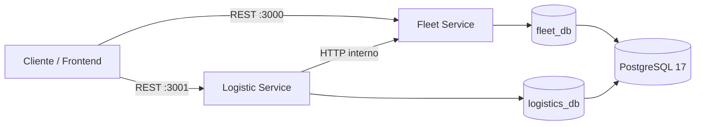
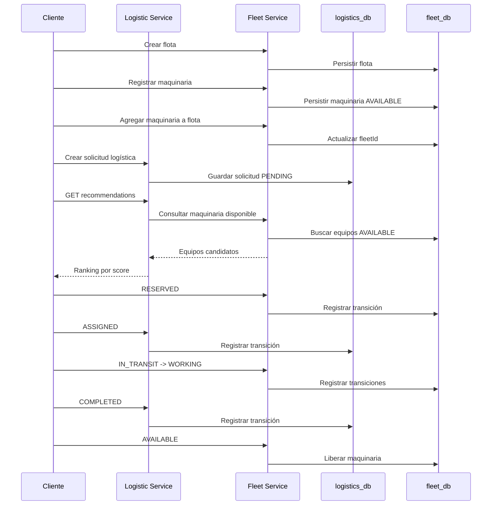

# Entropy Platform

Repositorio de integración para la plataforma **Entropy**, compuesto por dos microservicios independientes administrados como **Git submodules**:

- **`fleet-service`**: administra flotas, maquinaria pesada, disponibilidad y ciclo operativo de los equipos.
- **`logistic-service`**: administra solicitudes logísticas y genera recomendaciones de maquinaria consultando a `fleet-service`.

El repositorio padre no reemplaza a los repositorios de los microservicios. Su objetivo es mantener una **versión integrada y reproducible** de ambos servicios, junto con la infraestructura local, inicialización de PostgreSQL y pruebas end-to-end.

---

## Tabla de contenido

- [Arquitectura](#arquitectura)
- [Responsabilidades de cada servicio](#responsabilidades-de-cada-servicio)
- [Estructura del repositorio](#estructura-del-repositorio)
- [Tecnologías](#tecnologías)
- [Requisitos](#requisitos)
- [Git submodules](#git-submodules)
- [Levantar la plataforma localmente](#levantar-la-plataforma-localmente)
- [Servicios y puertos](#servicios-y-puertos)
- [Base de datos](#base-de-datos)
- [Health checks](#health-checks)
- [API de Fleet Service](#api-de-fleet-service)
- [API de Logistic Service](#api-de-logistic-service)
- [Estados y flujos](#estados-y-flujos)
- [Motor de recomendaciones](#motor-de-recomendaciones)
- [Caso de uso integrado](#caso-de-uso-integrado)
- [Prueba end-to-end](#prueba-end-to-end)
- [Comandos útiles](#comandos-útiles)
- [Observabilidad](#observabilidad)
- [Desarrollo de los submódulos](#desarrollo-de-los-submódulos)
- [Solución de problemas](#solución-de-problemas)

---

# Arquitectura



En el entorno local, Docker Compose levanta una sola instancia de PostgreSQL y crea dos bases de datos independientes:

```text
fleet-service    ──────> fleet_db
logistic-service ──────> logistics_db

logistic-service ─HTTP─> fleet-service
```

La comunicación interna entre los microservicios utiliza el DNS de Docker Compose:

```text
http://fleet-service:3000
```

Desde la máquina host las APIs están disponibles en:

```text
Fleet API:    http://localhost:3000
Logistic API: http://localhost:3001
```

---

# Responsabilidades de cada servicio

## Fleet Service

Responsable del inventario y operación de maquinaria pesada.

Permite:

- registrar maquinaria;
- consultar maquinaria con filtros y paginación;
- actualizar información de maquinaria;
- controlar el estado operativo de cada equipo;
- consultar el historial de cambios de estado;
- crear y administrar flotas;
- agregar maquinaria a una flota;
- retirar maquinaria de una flota;
- consultar la maquinaria perteneciente a una flota.

## Logistic Service

Responsable de las necesidades logísticas de los proyectos.

Permite:

- crear solicitudes logísticas;
- consultar y modificar solicitudes pendientes;
- controlar el ciclo de vida de una solicitud;
- consultar su historial de estados;
- consultar a `fleet-service` para encontrar equipos elegibles;
- calcular distancia, mantenimiento disponible y combustible;
- generar un ranking de recomendaciones.

---

# Estructura del repositorio

```text
entropy-platform/
├── .gitmodules
├── README.md
├── compose.yaml
│
├── postgres/
│   └── init.sql
│
├── fleet-logistic-e2e-test.sh
│
├── fleet-service/          # Git submodule
│   ├── cmd/
│   ├── internal/
│   ├── Dockerfile
│   ├── go.mod
│   └── README.md
│
└── logistic-service/       # Git submodule
    ├── cmd/
    ├── internal/
    ├── Dockerfile
    ├── go.mod
    └── README.md
```

Los directorios `fleet-service/` y `logistic-service/` son repositorios independientes. `entropy-platform` solamente conserva el commit exacto de cada uno que forma parte de la versión integrada.

---

# Tecnologías

| Tecnología | Uso |
|---|---|
| Go 1.27 | Desarrollo de los microservicios |
| Gin | APIs HTTP REST |
| GORM | ORM y acceso a datos |
| PostgreSQL 17 | Persistencia |
| UUID | Identificadores de entidades |
| Docker | Construcción de imágenes |
| Docker Compose | Orquestación local de la plataforma |
| Git Submodules | Integración de los repositorios independientes |
| OpenTelemetry | Trazas distribuidas |
| OTLP/gRPC | Exportación de telemetría |
| Google Cloud Logging | Logging opcional en GCP |
| Google Error Reporting | Reporte opcional de errores |
| Bash | Prueba integrada E2E |
| curl | Ejecución de peticiones HTTP en las pruebas |
| jq | Construcción y validación de JSON en las pruebas |

---

# Requisitos

Para levantar toda la plataforma mediante Docker Compose se requiere:

- Git;
- Docker;
- Docker Compose v2.

Para ejecutar la prueba integrada también se requiere:

- `bash`;
- `curl`;
- `jq`.

Comprobar versiones:

```bash
git --version
docker --version
docker compose version
curl --version
jq --version
```

No es necesario instalar PostgreSQL ni Go localmente si ambos servicios se ejecutarán con Docker Compose.

---

# Git submodules

## Clonar el proyecto por primera vez

La forma recomendada es clonar el repositorio padre junto con todos sus submódulos:

```bash
git clone --recurse-submodules <URL_DEL_REPOSITORIO_ENTROPY_PLATFORM>
cd entropy-platform
```

Comprobar los submódulos:

```bash
git submodule status
```

## Si el repositorio ya fue clonado sin los submódulos

Ejecutar:

```bash
git submodule update --init --recursive
```

## Actualizar los commits registrados por el repo padre

Cada microservicio puede evolucionar de manera independiente.

Ejemplo para `fleet-service`:

```bash
cd fleet-service
git switch main
git pull
cd ..
```

Ejemplo para `logistic-service`:

```bash
cd logistic-service
git switch main
git pull
cd ..
```

Después de actualizar uno o ambos submódulos, el repositorio padre detectará que ahora apuntan a commits nuevos:

```bash
git status
```

Registrar la nueva combinación integrada:

```bash
git add fleet-service logistic-service
git commit -m "chore: update service submodules"
git push
```

> El commit del repositorio padre no copia el código de los servicios. Guarda el commit específico al que apunta cada submódulo.

## Restaurar la versión exacta definida por `entropy-platform`

Si un submódulo fue cambiado localmente y se quiere volver al commit registrado por el padre:

```bash
git submodule update --init --recursive
```

---

# Levantar la plataforma localmente

## 1. Clonar e inicializar submódulos

```bash
git clone --recurse-submodules <URL_DEL_REPOSITORIO_ENTROPY_PLATFORM>
cd entropy-platform
```

Si ya existe el clone:

```bash
git submodule update --init --recursive
```

## 2. Construir y levantar todos los servicios

Desde la raíz de `entropy-platform`:

```bash
docker compose up --build
```

Para ejecutarlo en segundo plano:

```bash
docker compose up -d --build
```

Compose construirá las imágenes usando:

```text
./fleet-service/Dockerfile
./logistic-service/Dockerfile
```

## 3. Comprobar los contenedores

```bash
docker compose ps
```

Deberían existir al menos:

```text
entropy-postgres
fleet-service
logistic-service
```

## 4. Revisar logs

```bash
docker compose logs -f
```

Solo Fleet:

```bash
docker compose logs -f fleet-service
```

Solo Logistics:

```bash
docker compose logs -f logistic-service
```

## 5. Detener la plataforma

```bash
docker compose down
```

Para detenerla y eliminar también los datos locales de PostgreSQL:

```bash
docker compose down -v
```

> `-v` elimina el volumen `postgres_data`. Utilizarlo únicamente cuando se quiera reinicializar completamente la base local.

---

# Servicios y puertos

| Servicio | Contenedor | Puerto host | Puerto interno | URL |
|---|---|---:|---:|---|
| PostgreSQL | `entropy-postgres` | `5432` | `5432` | `localhost:5432` |
| Fleet Service | `fleet-service` | `3000` | `3000` | `http://localhost:3000` |
| Logistic Service | `logistic-service` | `3001` | `3001` | `http://localhost:3001` |

Dentro de la red de Compose, Logistics utiliza:

```env
FLEET_SERVICE_URL=http://fleet-service:3000
```

No debe utilizar `localhost:3000` desde el contenedor de Logistics, ya que `localhost` apuntaría al mismo contenedor de `logistic-service`.

---

# Base de datos

El servicio PostgreSQL utiliza:

```text
Usuario:   app
Password:  app_local_password
Puerto:    5432
```

Estas credenciales son únicamente para desarrollo local.

El archivo:

```text
postgres/init.sql
```

crea automáticamente:

```sql
CREATE DATABASE fleet_db OWNER app;
CREATE DATABASE logistics_db OWNER app;
```

## Conexiones utilizadas por los servicios

### Fleet

```text
host=postgres
user=app
password=app_local_password
dbname=fleet_db
port=5432
sslmode=disable
TimeZone=UTC
```

### Logistics

```text
host=postgres
user=app
password=app_local_password
dbname=logistics_db
port=5432
sslmode=disable
TimeZone=UTC
```

## Conectarse manualmente desde el host

Si `psql` está instalado:

```bash
PGPASSWORD=app_local_password \
psql -h localhost -p 5432 -U app -d fleet_db
```

Para Logistics:

```bash
PGPASSWORD=app_local_password \
psql -h localhost -p 5432 -U app -d logistics_db
```

---

# Health checks

## Fleet Service

```bash
curl http://localhost:3000/health
```

Respuesta esperada:

```json
{
  "Status": "Up and Running"
}
```

## Logistic Service

```bash
curl http://localhost:3001/health
```

Respuesta esperada:

```json
{
  "Status": "Up and Running"
}
```

---

# API de Fleet Service

Base URL:

```text
http://localhost:3000/api/v1
```

## Endpoints de maquinaria

| Método | Endpoint | Descripción |
|---|---|---|
| `POST` | `/equipments` | Registrar maquinaria |
| `GET` | `/equipments` | Listar y filtrar maquinaria |
| `GET` | `/equipments/:id` | Consultar maquinaria por UUID |
| `PATCH` | `/equipments/:id` | Actualizar datos de maquinaria |
| `PATCH` | `/equipments/:id/status` | Cambiar estado operativo |
| `GET` | `/equipments/:id/status-history` | Consultar historial de estados |

## Endpoints de flotas

| Método | Endpoint | Descripción |
|---|---|---|
| `POST` | `/fleets` | Crear una flota |
| `GET` | `/fleets` | Listar flotas |
| `GET` | `/fleets/:fleetID` | Consultar flota |
| `PATCH` | `/fleets/:fleetID` | Actualizar flota |
| `PUT` | `/fleets/:fleetID/equipments/:equipmentID` | Agregar maquinaria a la flota |
| `DELETE` | `/fleets/:fleetID/equipments/:equipmentID` | Retirar maquinaria de la flota |
| `GET` | `/fleets/:fleetID/equipments` | Listar maquinaria de la flota |

## Ejemplo: crear una flota

```bash
curl -X POST http://localhost:3000/api/v1/fleets \
  -H 'Content-Type: application/json' \
  -d '{
    "code": "FLEET-SV-001",
    "name": "Flota San Miguel"
  }'
```

Respuesta esperada:

```text
HTTP 201 Created
```

La respuesta contiene el UUID generado para la flota.

## Ejemplo: crear maquinaria

```bash
curl -X POST http://localhost:3000/api/v1/equipments \
  -H 'Content-Type: application/json' \
  -d '{
    "code": "EXC-001",
    "type": "EXCAVATOR",
    "brand": "Caterpillar",
    "model": "320",
    "serialNumber": "CAT320-0001",
    "year": 2026,
    "capacityTons": 23,
    "location": {
      "name": "San Miguel",
      "latitude": 13.4835,
      "longitude": -88.1828
    },
    "engineHours": 100,
    "maintenanceIntervalHours": 500,
    "fuelPercent": 95
  }'
```

Respuesta esperada:

```text
HTTP 201 Created
```

La maquinaria inicia disponible y el servicio calcula el siguiente límite de mantenimiento a partir de las horas actuales y el intervalo configurado.

Ejemplo conceptual:

```text
engineHours = 100
maintenanceIntervalHours = 500
nextMaintenanceHours = 600
```

## Ejemplo: asignar maquinaria a una flota

```bash
curl -X PUT \
  http://localhost:3000/api/v1/fleets/<FLEET_ID>/equipments/<EQUIPMENT_ID>
```

Respuesta esperada:

```text
HTTP 200 OK
```

## Ejemplo: cambiar estado de maquinaria

```bash
curl -X PATCH \
  http://localhost:3000/api/v1/equipments/<EQUIPMENT_ID>/status \
  -H 'Content-Type: application/json' \
  -d '{
    "status": "RESERVED",
    "reason": "Reservada para solicitud logística"
  }'
```

Respuesta esperada:

```text
HTTP 200 OK
```

Una transición que no sea válida devuelve:

```text
HTTP 422 Unprocessable Entity
```

---

# API de Logistic Service

Base URL:

```text
http://localhost:3001/api/v1
```

| Método | Endpoint | Descripción |
|---|---|---|
| `POST` | `/requests` | Crear solicitud logística |
| `GET` | `/requests` | Listar solicitudes |
| `GET` | `/requests/:requestID` | Consultar solicitud |
| `PATCH` | `/requests/:requestID` | Modificar una solicitud `PENDING` |
| `PATCH` | `/requests/:requestID/status` | Cambiar estado |
| `GET` | `/requests/:requestID/status-history` | Consultar historial |
| `GET` | `/requests/:requestID/recommendations` | Generar recomendaciones de maquinaria |

## Ejemplo: crear una solicitud

```bash
curl -X POST http://localhost:3001/api/v1/requests \
  -H 'Content-Type: application/json' \
  -d '{
    "equipmentType": "EXCAVATOR",
    "projectName": "Proyecto San Miguel",
    "location": {
      "name": "San Miguel",
      "latitude": 13.4833,
      "longitude": -88.1833
    },
    "startDate": "2030-09-10T08:00:00Z",
    "endDate": "2030-09-15T18:00:00Z"
  }'
```

Respuesta esperada:

```text
HTTP 201 Created
```

La solicitud inicia en:

```json
{
  "status": "PENDING"
}
```

## Ejemplo: solicitar recomendaciones

```bash
curl \
  http://localhost:3001/api/v1/requests/<REQUEST_ID>/recommendations
```

Ejemplo de respuesta:

```json
{
  "data": {
    "requestId": "<REQUEST_ID>",
    "count": 1,
    "recommendations": [
      {
        "equipmentId": "<EQUIPMENT_ID>",
        "code": "EXC-001",
        "type": "EXCAVATOR",
        "brand": "Caterpillar",
        "model": "320",
        "distanceKm": 0.06,
        "engineHours": 100,
        "nextMaintenanceHours": 600,
        "maintenanceHoursRemaining": 500,
        "fuelPercent": 95,
        "score": 99.23,
        "reasons": [
          "Maquinaria disponible",
          "Se encuentra a 0.06 km del proyecto",
          "Tiene 500.00 horas antes del próximo mantenimiento",
          "Nivel de combustible de 95.00%"
        ]
      }
    ]
  }
}
```

Si no existen candidatos válidos, la petición sigue siendo exitosa:

```json
{
  "data": {
    "requestId": "<REQUEST_ID>",
    "count": 0,
    "recommendations": []
  }
}
```

Si la solicitud ya no está `PENDING`:

```text
HTTP 409 Conflict
```

Ejemplo:

```json
{
  "error": "request_not_pending",
  "message": "Solo se pueden generar recomendaciones para peticiones con estado PENDING"
}
```

Si Logistics no puede consultar Fleet:

```text
HTTP 502 Bad Gateway
```

```json
{
  "error": "fleet_service_unavailable",
  "message": "No se pudo consultar la maquinaria disponible"
}
```

---

# Estados y flujos

## Estados de maquinaria

| Estado | Descripción |
|---|---|
| `AVAILABLE` | Disponible para ser recomendada o reservada |
| `RESERVED` | Reservada para un trabajo |
| `IN_TRANSIT` | En traslado al proyecto |
| `WORKING` | Ejecutando el trabajo |
| `MAINTENANCE` | En mantenimiento |
| `INACTIVE` | Temporalmente inactiva |
| `RETIRED` | Retirada definitivamente |

## Transiciones permitidas de maquinaria

| Estado actual | Siguientes estados permitidos |
|---|---|
| `AVAILABLE` | `RESERVED`, `MAINTENANCE`, `INACTIVE` |
| `RESERVED` | `AVAILABLE`, `IN_TRANSIT`, `WORKING`, `MAINTENANCE` |
| `IN_TRANSIT` | `AVAILABLE`, `WORKING`, `MAINTENANCE` |
| `WORKING` | `AVAILABLE`, `MAINTENANCE` |
| `MAINTENANCE` | `AVAILABLE`, `INACTIVE` |
| `INACTIVE` | `AVAILABLE`, `RETIRED` |
| `RETIRED` | Ninguno |

Flujo operacional común:

```text
AVAILABLE
   │
   ▼
RESERVED
   │
   ▼
IN_TRANSIT
   │
   ▼
WORKING
   │
   ▼
AVAILABLE
```

## Estados de solicitudes logísticas

| Estado | Descripción |
|---|---|
| `PENDING` | Pendiente de selección/asignación de maquinaria |
| `ASSIGNED` | Solicitud confirmada |
| `COMPLETED` | Operación completada |
| `CANCELLED` | Solicitud cancelada |

Transiciones:

```text
PENDING ─────────> ASSIGNED ─────────> COMPLETED
   │                  │
   │                  └──────────────> CANCELLED
   │
   └─────────────────────────────────> CANCELLED
```

Una solicitud `COMPLETED` o `CANCELLED` se considera terminal.

---

# Motor de recomendaciones

`logistic-service` consulta a `fleet-service` en tiempo real para determinar qué maquinaria es elegible para una solicitud.

## Elegibilidad

Un equipo participa en el ranking cuando cumple:

```text
status == AVAILABLE
AND type == request.equipmentType
AND nextMaintenanceHours - engineHours > 0
```

Por esto, reservar un equipo en Fleet hace que deje de aparecer en una siguiente consulta de recomendaciones.

## Factores evaluados

El score máximo es de `100` puntos:

| Factor | Peso |
|---|---:|
| Cercanía al proyecto | 60 |
| Margen antes del mantenimiento | 25 |
| Nivel de combustible | 15 |
| **Total** | **100** |

## Distancia

La distancia se calcula mediante la fórmula de **Haversine**, usando la latitud y longitud del proyecto y de cada maquinaria.

La distancia representa una aproximación geográfica en línea recta y no una ruta vial.

## Fórmula del score

```text
distanceFactor    = 1 - clamp(distanceKm / 200, 0, 1)
maintenanceFactor = clamp(maintenanceHoursRemaining / 500, 0, 1)
fuelFactor        = clamp(fuelPercent / 100, 0, 1)

score = distanceFactor * 60
      + maintenanceFactor * 25
      + fuelFactor * 15
```

Donde:

```text
maintenanceHoursRemaining = nextMaintenanceHours - engineHours
```

El mayor score representa la recomendación más favorable bajo los criterios actuales.

---

# Caso de uso integrado

El flujo principal de la plataforma puede representarse así:



### Ejemplo funcional

1. Se crea una flota.
2. Se registran dos excavadoras.
3. Ambas se agregan a la flota.
4. Se crea una solicitud `PENDING` para una excavadora en San Miguel.
5. Logistics consulta Fleet.
6. El motor calcula el score de cada excavadora.
7. La excavadora más cercana y con mejores condiciones obtiene un score mayor.
8. El equipo seleccionado cambia de `AVAILABLE` a `RESERVED`.
9. Al volver a consultar recomendaciones, el equipo reservado ya no aparece.
10. La solicitud cambia de `PENDING` a `ASSIGNED`.
11. La maquinaria pasa a `IN_TRANSIT` y posteriormente a `WORKING`.
12. La solicitud finaliza en `COMPLETED`.
13. La maquinaria vuelve a `AVAILABLE`.
14. Se consultan los historiales para validar el ciclo completo.

---

# Prueba end-to-end

El repositorio padre incluye:

```text
fleet-logistic-e2e-test.sh
```

Este script valida la integración real entre los dos microservicios.

## Requisitos

```text
curl
jq
fleet-service en ejecución
logistic-service en ejecución
```

## Ejecutar

```bash
chmod +x fleet-logistic-e2e-test.sh
./fleet-logistic-e2e-test.sh
```

Por defecto utiliza:

```text
FLEET_BASE_URL=http://localhost:3000/api/v1
LOGISTIC_BASE_URL=http://localhost:3001/api/v1
```

También se pueden sobrescribir:

```bash
FLEET_BASE_URL=http://localhost:3000/api/v1 \
LOGISTIC_BASE_URL=http://localhost:3001/api/v1 \
./fleet-logistic-e2e-test.sh
```

## Qué valida

La prueba integrada:

1. comprueba que ambos servicios respondan;
2. crea una flota;
3. crea una excavadora cercana;
4. crea una excavadora más distante;
5. agrega ambas a la flota;
6. crea una solicitud logística `PENDING`;
7. obtiene recomendaciones;
8. comprueba que ambas máquinas sean candidatas;
9. comprueba que la máquina cercana tenga mayor score;
10. reserva la mejor recomendación;
11. comprueba que la máquina `RESERVED` ya no aparezca;
12. cambia la solicitud a `ASSIGNED`;
13. comprueba que una solicitud asignada ya no genere recomendaciones;
14. pasa la maquinaria por `IN_TRANSIT` y `WORKING`;
15. completa la solicitud;
16. libera la maquinaria a `AVAILABLE`;
17. comprueba los estados finales;
18. valida los historiales de ambos servicios;
19. retira las máquinas de la flota.

Al finalizar correctamente se muestra:

```text
Todas las pruebas integradas finalizaron correctamente.
```

Además imprime los UUID creados durante la ejecución.

---

# Comandos útiles

## Construir todo

```bash
docker compose build
```

## Levantar todo

```bash
docker compose up -d
```

## Reconstruir después de modificar código

```bash
docker compose up -d --build
```

## Reiniciar un solo servicio

```bash
docker compose restart fleet-service
```

```bash
docker compose restart logistic-service
```

## Reconstruir solamente Fleet

```bash
docker compose up -d --build fleet-service
```

## Reconstruir solamente Logistics

```bash
docker compose up -d --build logistic-service
```

## Ver logs

```bash
docker compose logs -f fleet-service logistic-service
```

## Ver estado

```bash
docker compose ps
```

## Ver procesos de Docker

```bash
docker ps
```

## Reinicializar las bases locales

```bash
docker compose down -v
docker compose up -d --build
```

---

# Observabilidad

Ambos servicios cuentan con soporte para OpenTelemetry.

En el Compose integrado se utiliza:

```env
TRACE_TYPE=NONE
```

para mantener simple el entorno local.

Los servicios soportan configuraciones de tracing como:

```text
STDOUT
OTLP
GCP
NONE
DISABLED
```

En ambientes con un collector OpenTelemetry se puede configurar un endpoint OTLP mediante las variables propias de cada microservicio.

Para detalles de logging, tracing y configuración de Google Cloud consultar los `README.md` dentro de cada submódulo.

---

# Desarrollo de los submódulos

## ¿Dónde modificar Fleet?

Trabajar directamente dentro de:

```bash
cd fleet-service
```

Los commits de Fleet deben realizarse en el repositorio de Fleet:

```bash
git status
git add .
git commit -m "feat: ..."
git push
```

Después, desde `entropy-platform`, registrar el nuevo commit del submódulo:

```bash
cd ..
git add fleet-service
git commit -m "chore: update fleet-service"
git push
```

## ¿Dónde modificar Logistics?

El mismo flujo aplica a:

```bash
cd logistic-service
```

Primero se hace commit y push en `logistic-service`; después se actualiza el puntero del submódulo en `entropy-platform`.

## ¿Qué debe vivir en el repositorio padre?

Archivos relacionados con la integración de ambos servicios, por ejemplo:

```text
compose.yaml
postgres/init.sql
fleet-logistic-e2e-test.sh
README.md
```

## ¿Qué debe vivir en cada microservicio?

Código y configuración específica del servicio:

```text
cmd/
internal/
go.mod
go.sum
Dockerfile
README.md
pruebas propias del servicio
```

Esto mantiene los repositorios desacoplados, pero permite probar una versión compatible de ambos desde `entropy-platform`.

---

# Solución de problemas

## `logistic-service` devuelve `502 fleet_service_unavailable`

Ejemplo:

```json
{
  "error": "fleet_service_unavailable",
  "message": "No se pudo consultar la maquinaria disponible"
}
```

Comprobar primero Fleet:

```bash
curl http://localhost:3000/health
```

Luego revisar logs:

```bash
docker compose logs fleet-service logistic-service
```

Dentro de Compose, `FLEET_SERVICE_URL` debe apuntar a:

```text
http://fleet-service:3000
```

No a `localhost:3000`.

---

## Logistics devuelve recomendaciones vacías

Comprobar que exista maquinaria que cumpla simultáneamente:

```text
status = AVAILABLE
mismo equipmentType de la solicitud
horas restantes antes de mantenimiento > 0
```

Consultar Fleet:

```bash
curl 'http://localhost:3000/api/v1/equipments?page=1&pageSize=100'
```

---

## Un equipo reservado no aparece en recomendaciones

Es el comportamiento esperado.

El motor solamente considera maquinaria:

```text
AVAILABLE
```

Por lo tanto, un equipo en `RESERVED`, `IN_TRANSIT`, `WORKING`, `MAINTENANCE`, `INACTIVE` o `RETIRED` queda fuera del ranking.

---

## La base no contiene las tablas esperadas

Comprobar que PostgreSQL esté saludable:

```bash
docker compose ps
```

Revisar logs:

```bash
docker compose logs postgres
```

Los servicios ejecutan sus migraciones de aplicación al iniciar, mientras `postgres/init.sql` se encarga únicamente de crear las dos bases de datos.

Si se necesita una reinicialización completa del entorno local:

```bash
docker compose down -v
docker compose up -d --build
```

---

## Los submódulos aparecen vacíos

Ejecutar:

```bash
git submodule update --init --recursive
```

---

## El repositorio padre muestra cambios aunque no se editó ningún archivo suyo

Puede significar que uno de los submódulos está apuntando a otro commit.

Comprobar:

```bash
git status
git submodule status
```

Si el cambio es intencional, registrar el nuevo puntero con `git add <submodule>` y hacer commit en `entropy-platform`.

---

# Documentación de cada servicio

Para detalles específicos de DTOs, validaciones, respuestas de error y notas de implementación consultar:

```text
fleet-service/README.md
logistic-service/README.md
```

Este README documenta principalmente la **integración entre ambos servicios y la ejecución de la plataforma completa**.
